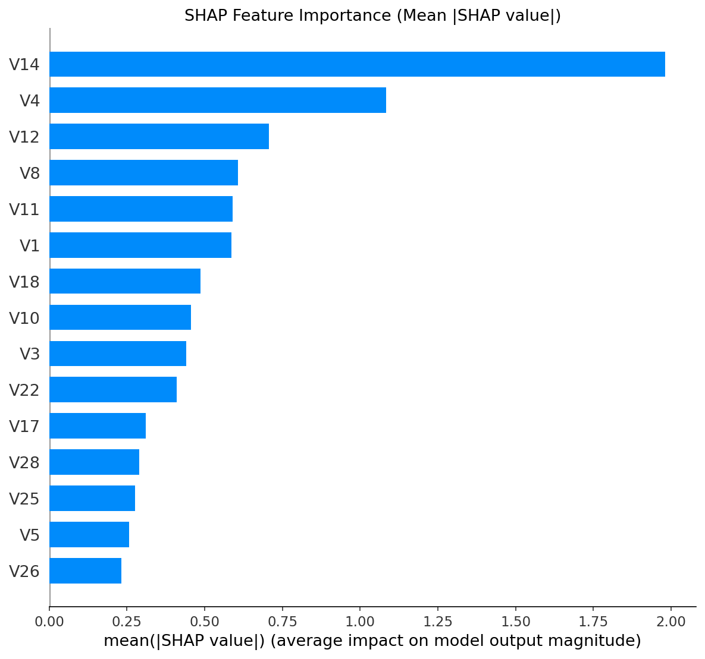
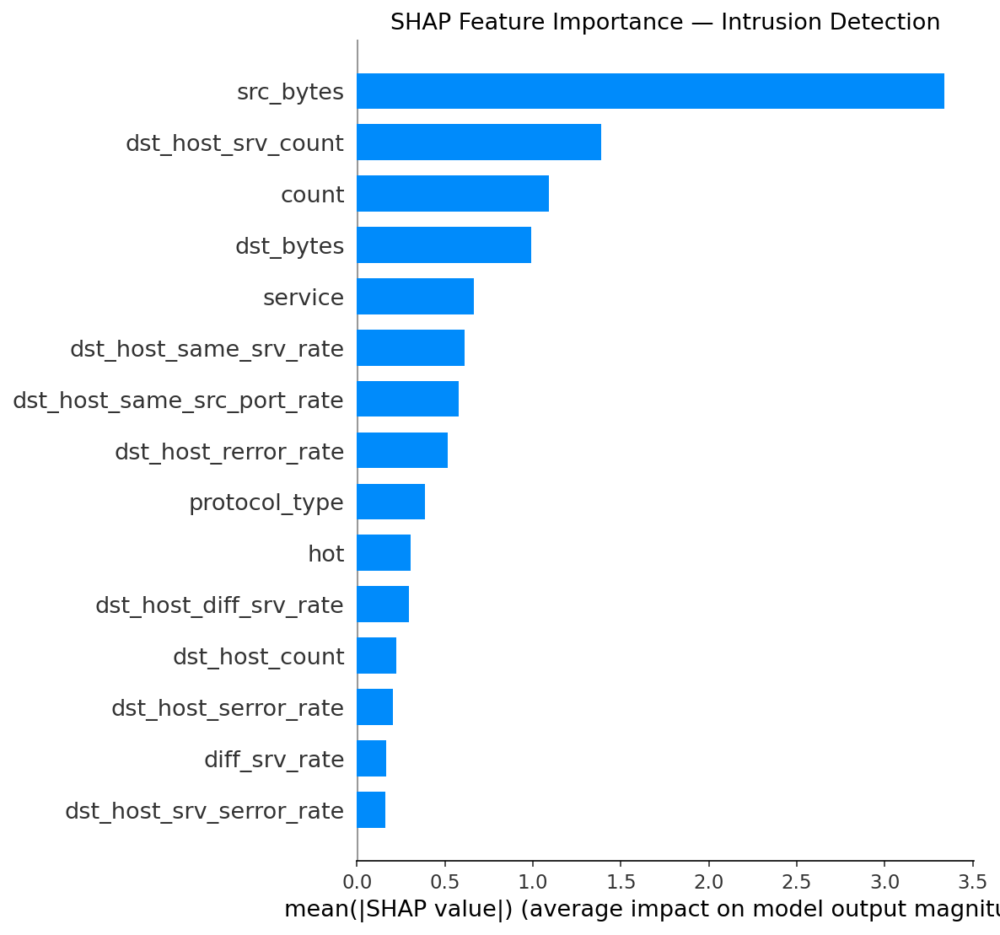
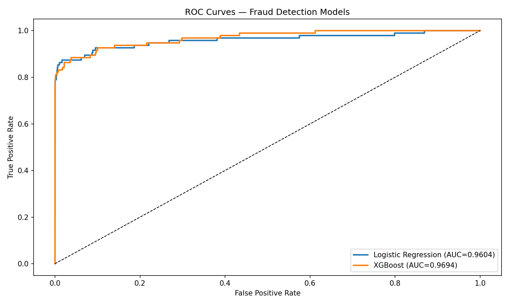
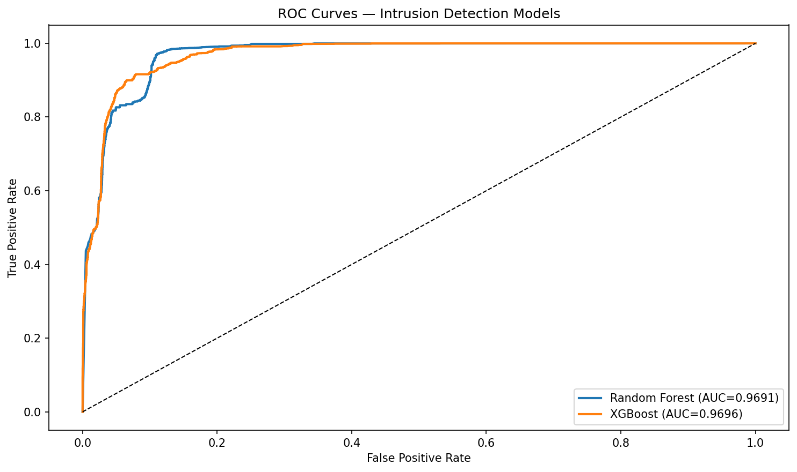

# 🛡️ Anomaly Detection Platform


A production-grade unified ML platform for **Financial Fraud Detection** and **Network Intrusion Detection** — featuring modular pipelines, SHAP explainability, a REST API, and an interactive dashboard.

---

## 🎯 Project Overview

Most anomaly detection projects stop at a Jupyter notebook. This platform goes further:

- **Two detection domains** in one unified system
- **Dual-layer detection** — XGBoost + Isolation Forest combined scoring
- **Explainability** — SHAP values for every prediction
- **REST API** — FastAPI backend serving both models
- **Interactive UI** — Streamlit dashboard with batch CSV upload

---

## 📊 Model Performance

### Fraud Detection (Credit Card Dataset — 284,807 transactions)

| Model                          | ROC-AUC    | Avg Precision |
| ------------------------------ | ---------- | ------------- |
| Logistic Regression (baseline) | 0.9604     | —             |
| XGBoost                        | **0.9694** | 0.7899        |
| XGBoost + Isolation Forest     | 0.9582     | —             |

> Dataset imbalance: 577:1 (non-fraud:fraud) — handled with SMOTE + threshold tuning

### Intrusion Detection (NSL-KDD Dataset — 125,973 records)

| Model         | ROC-AUC    | Avg Precision |
| ------------- | ---------- | ------------- |
| Random Forest | 0.9691     | 0.9699        |
| XGBoost       | **0.9696** | 0.9725        |

> 5-class attack taxonomy: DoS, Probe, R2L, U2R, Normal

---

## 🏗️ System Architecture

```
anomaly-detection-platform/
│
├── data/
│ └── raw/
│ ├── fraud/ # Credit Card Fraud CSV
│ └── intrusion/ # NSL-KDD Train/Test
│
├── src/
│ ├── shared/ # Common preprocessing pipeline
│ ├── fraud/ # Fraud module (preprocess, train, explain, anomaly)
│ ├── intrusion/ # Intrusion module (preprocess, train, explain)
│ ├── api/ # FastAPI backend
│ └── dashboard/ # Streamlit frontend
│
├── models/
│ ├── fraud/ # XGBoost, Isolation Forest, Scaler
│ └── intrusion/ # XGBoost, Random Forest, Scaler
│
└── reports/figures/ # SHAP plots, ROC curves, EDA charts
```

---

## 🔬 Key Technical Decisions

**Why SMOTE on fraud data?**
The 577:1 class imbalance means a naive model predicts "normal" always and gets 99.8% accuracy. SMOTE synthetically generates fraud samples in feature space, forcing the model to learn actual fraud patterns.

**Why Isolation Forest on top of XGBoost?**
XGBoost is supervised — it needs labels. Isolation Forest is unsupervised — it detects transactions that are structurally anomalous regardless of labels. Combining both (70/30 weight) catches fraud patterns the supervised model may miss.

**Why SHAP over standard feature importance?**
Standard feature importance tells you which features matter globally. SHAP tells you _why_ a specific transaction was flagged — direction and magnitude per feature, per prediction. This is what makes the system auditable.

---

## 🚀 Quick Start

### 1. Clone and Setup

```bash
git clone https://github.com/silent-knight-22/anomaly-detection-platform.git
cd anomaly-detection-platform
python -m venv venv
venv\Scripts\activate        # Windows
pip install -r requirements.txt
```

### 2. Add Datasets

Download and place in the correct folders:

- [Credit Card Fraud](https://www.kaggle.com/datasets/mlg-ulb/creditcardfraud) → `data/raw/fraud/creditcard.csv`
- [NSL-KDD](https://www.kaggle.com/datasets/hassan06/nslkdd) → `data/raw/intrusion/KDDTrain+.txt` and `KDDTest+.txt`

### 3. Train Models

```bash
python src/fraud/train.py
python src/fraud/explain.py
python src/fraud/anomaly.py
python src/intrusion/train.py
python src/intrusion/explain.py
```

### 4. Start the Platform

```bash
# Terminal 1 — API
uvicorn src.api.main:app --reload --port 8000

# Terminal 2 — Dashboard
streamlit run src/dashboard/app.py
```

Open `http://localhost:8501` in your browser.

---

## 📡 API Reference

### Health Check

```
GET /health

### Fraud Prediction

POST /predict/fraud
Content-Type: application/json
{
"features": [V1, V2, ..., V28, Amount] // 29 values
}
```

**Response:**

```json
{
  "prediction": 1,
  "label": "FRAUD",
  "fraud_probability": 0.923,
  "anomaly_score": 0.741,
  "combined_risk_score": 0.868,
  "risk_level": "HIGH"
}
```

### Intrusion Prediction

```
POST /predict/intrusion
Content-Type: application/json
{
"features": [f1, f2, ..., f41] // 41 NSL-KDD features
}

```

**Response:**

```json
{
  "prediction": 1,
  "label": "ATTACK",
  "attack_probability": 0.876,
  "risk_level": "HIGH"
}
```

---

## 📈 Results & Visualizations

### SHAP Feature Importance — Fraud



### SHAP Feature Importance — Intrusion



### ROC Curves — Fraud



### ROC Curves — Intrusion



---

## 🛠️ Tech Stack

| Layer              | Technology                              |
| ------------------ | --------------------------------------- |
| ML Models          | XGBoost, Scikit-learn, Isolation Forest |
| Explainability     | SHAP                                    |
| Imbalance Handling | SMOTE (imbalanced-learn)                |
| API                | FastAPI + Uvicorn                       |
| Dashboard          | Streamlit                               |
| Data Processing    | Pandas, NumPy                           |
| Visualization      | Matplotlib, Seaborn, Plotly             |
| Model Persistence  | Joblib                                  |

---

## 📁 Datasets

| Dataset           | Source                               | Size                 | Task                       |
| ----------------- | ------------------------------------ | -------------------- | -------------------------- |
| Credit Card Fraud | Kaggle / ULB                         | 284,807 transactions | Binary classification      |
| NSL-KDD           | Canadian Institute for Cybersecurity | 125,973 records      | Multi-class classification |

---

## 👤 Author

**Preeti**
B.Tech Information Technology — NIT Kurukshetra
[GitHub](https://github.com/silent-knight-22)
